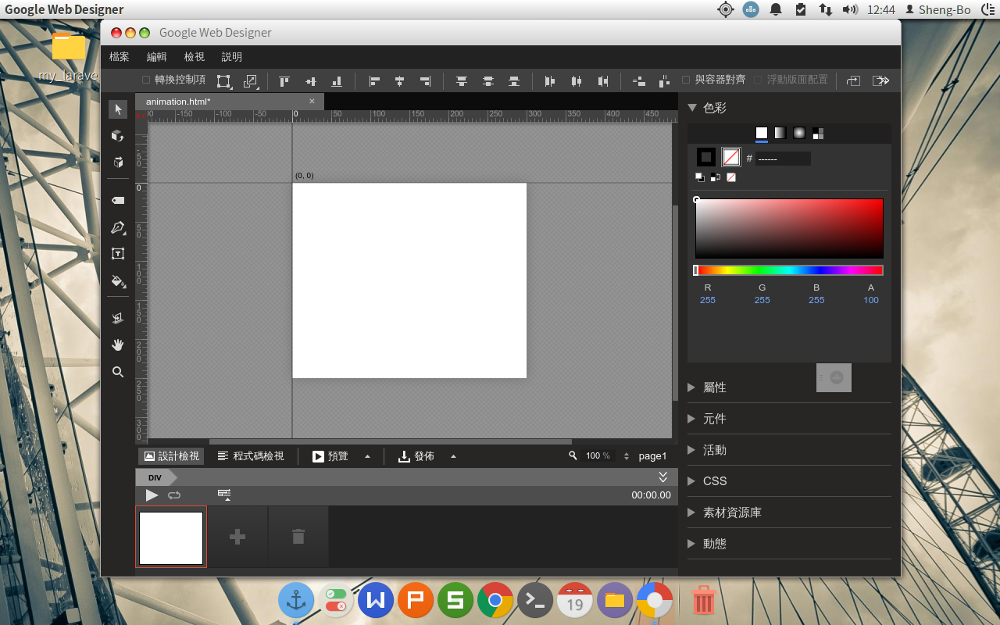
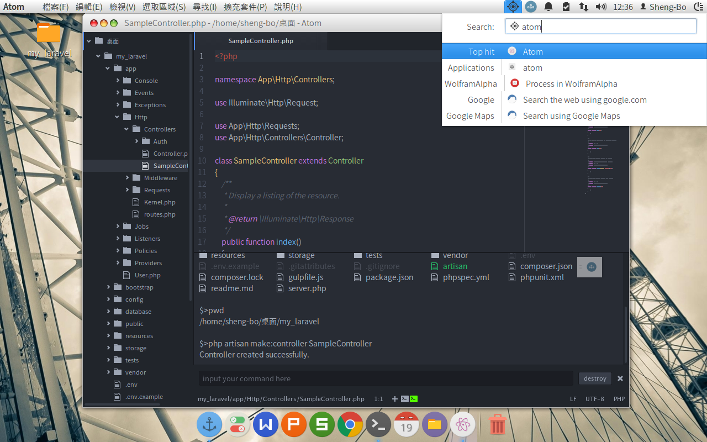
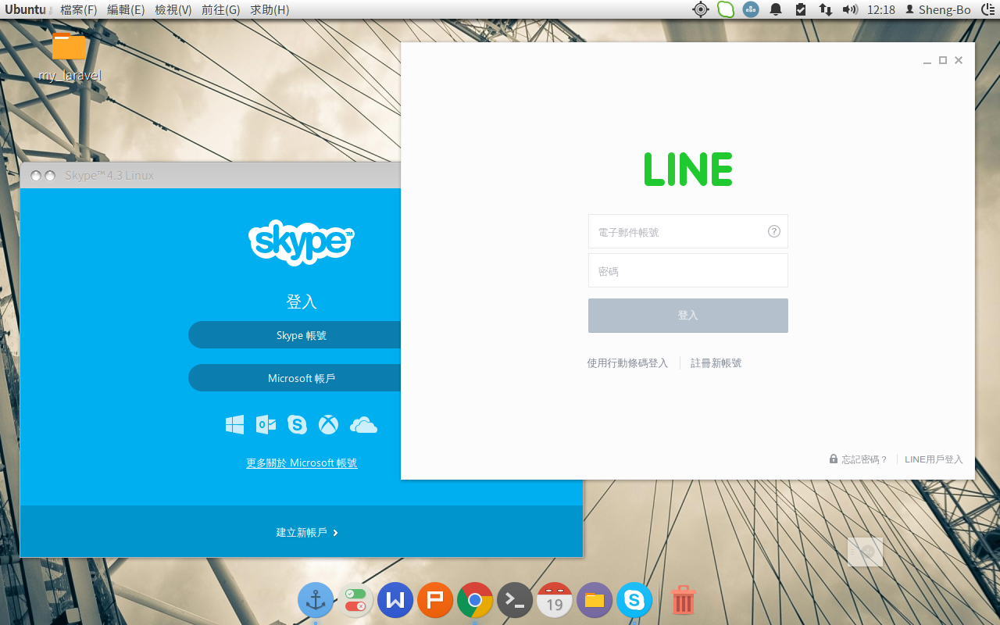
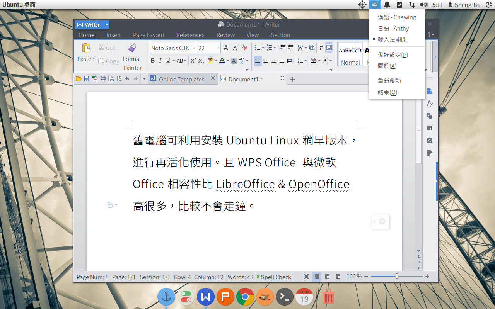

# EasyBuntu -- Ubuntu的自動設定與下載美化套件腳本
作者：陳聖博

這些腳本，主要的目的是在 Ubuntu (GNOME) 下：

1. 自動化安裝工作中和生活中需要的軟體，讓使用者不需要再一個一個的安裝，使 Linux 更親近人。
2. 自動下載美化桌面工具，經過簡單的佈景主題設定，使得 Linux 大量脫去工程味。

## 結果展示

### Google Web Designer HTML5 & CSS3 動畫工具

### Atom 編輯器與 Laravel

### Line & Skype

### WPS Office

--------------------------------------------------------------------------------

## 前言
雖然已經 2015 年底，但是仍選擇三年前的 12.04 做為 bash 的練習，有兩個考量。第一、舊版速度快，特別在 VirtualBox 內執行。第二、12.04 是 Google Chrome 瀏覽器支援的最低版本，至少可以正常執行 47 版。我在 Linux 上的造詣淺薄，本檔案如有錯誤，歡迎指正，以便完善自動化設定 Linux 的理想，謝謝。

## 使用方式
檔案下載至桌面後，拖入終端機，即可看到完整檔案路徑。前頭加上 bash 隔一個空白，例如：bash '/home/你的使用者名稱/桌面/setup.sh'。使用時請自負風險。

--------------------------------------------------------------------------------

## setup.sh 腳本內容
自動安裝各種可能用得到的套件，詳細請閱讀腳本內說明，對於不想安裝的套件，也可以打上 # 號註解。

1. 系統初始設定
2. 網路應用
3. 網站開發環境（前端）Git & Git-cola、Ruby、Node.js、Gulp、Atom 中文化與常用套件、Google Web Designer
4. 網站開發環境（後端）Apache、MySQL、PHP、composer
5. 文書處理環境 WPS Office、字型、無蝦米輸入法、日文輸入法
6. 平面設計 InkScape、GIMP
7. 多媒體處理環境 VLC 影音播放、Pitivi 影音剪輯、Kazam 螢幕錄製

## beautify.sh 腳本內容
自動下載美化套件，下載完畢後，請到 Ubuntu Tweak 調整佈景和字型的設定。建議將系統字型改用比 Ubuntu 或文泉譯更漂亮的字體，例如思源黑體 (已經在 setup.sh 中安裝了)。另外，桌布放在使用者家目錄的 Wallpapers 資料夾內。

--------------------------------------------------------------------------------

## 更新紀錄
### 1.0.0
更新日期：2015年12月02日 適用環境：Ubuntu Linux 12.04

--------------------------------------------------------------------------------

## 授權：GPL v3
歡迎大家一起加入 fork 的行列，也歡迎大家糾錯發 issue 給我。
